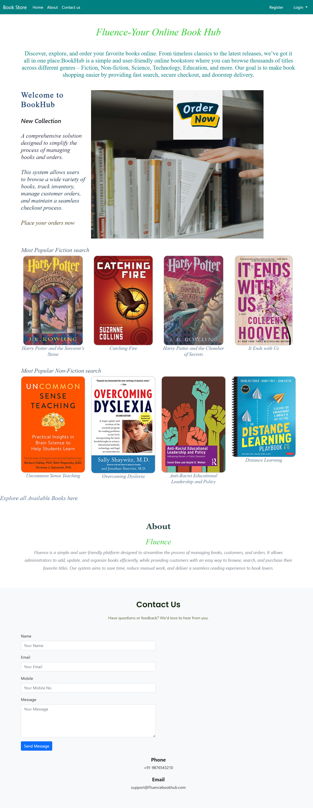
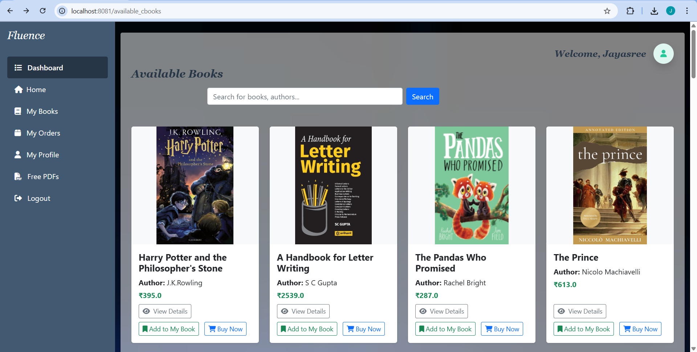
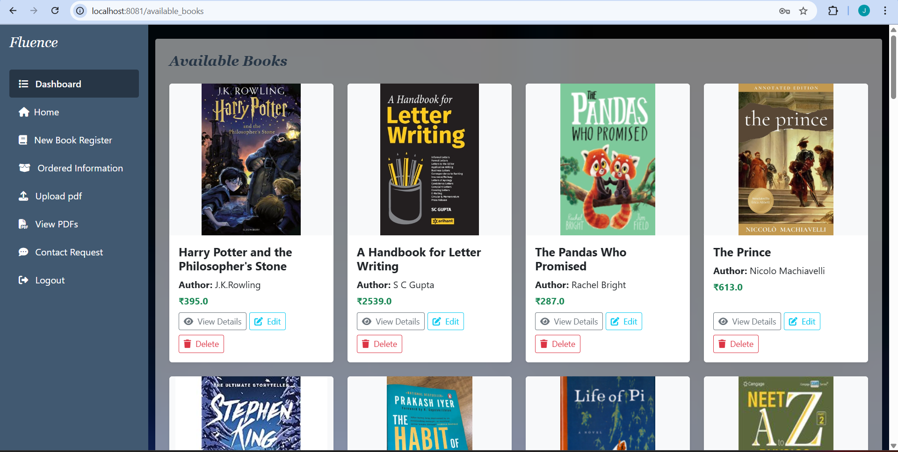

📚 SmartBookStore System

A Smart Book Store Management System built using Spring Boot, Thymeleaf, and MySQL.
This project provides a platform to browse, purchase, and manage books online with both user and admin features.

🚀 Features

👤 User Authentication – Secure login and registration

📖 Book Management – Browse, search, and view book details

🛒 Cart System – Add to cart and place orders

📦 Order Tracking – Track order history and status

👨‍💼 Admin Dashboard – Separate login for admins with username & password

Add, update, and delete books

Manage user orders

📊 Responsive UI – Clean interface with Thymeleaf templates

### Default Admin Credentials (for testing)
- Username: admin  
- Password: admin123  

🛠️ Technologies Used

Backend: Spring Boot (Java)

Frontend: Thymeleaf, HTML, CSS, Bootstrap

Database: MySQL

Tools & Build: Maven / Gradle, IntelliJ IDEA

📂 Project Structure

smartbookstore/
 ├── src/
 │   ├── main/
 │   │   ├── java/com/example/bookstore/   # Java source files
 │   │   ├── resources/
 │   │   │   ├── static/                   # CSS, JS, images
 │   │   │   ├── templates/                # Thymeleaf templates
 │   │   │   └── application.properties    # DB configuration
 ├── pom.xml / build.gradle                # Dependencies
 └── README.md

⚙️ Setup Instructions

Clone the Repository

git clone https://github.com/your-username/smartbookstore.git
cd smartbookstore

Configure Database

Create a MySQL database (e.g., bookstore_db)

Update application.properties with your DB username & password

spring.datasource.url=jdbc:mysql://localhost:3306/bookstore_db
spring.datasource.username=root
spring.datasource.password=Jsree
spring.jpa.hibernate.ddl-auto=update

Run the Application

mvn spring-boot:run

or

gradle bootRun

Access the App

Open browser → http://localhost:8080

📸 Screenshots

👉 (Add in project screenshots folder)
Example:

### Homepage  

### Book List  

### Admin Dashboard  

📌 Future Enhancements

📱 Add REST API for mobile integration

💳 Payment gateway integration

⭐ User reviews & ratings for books

📜 License

This project is licensed under the MIT License – feel free to use and modify.

This project is licensed under the MIT License – feel free to use and modify.
